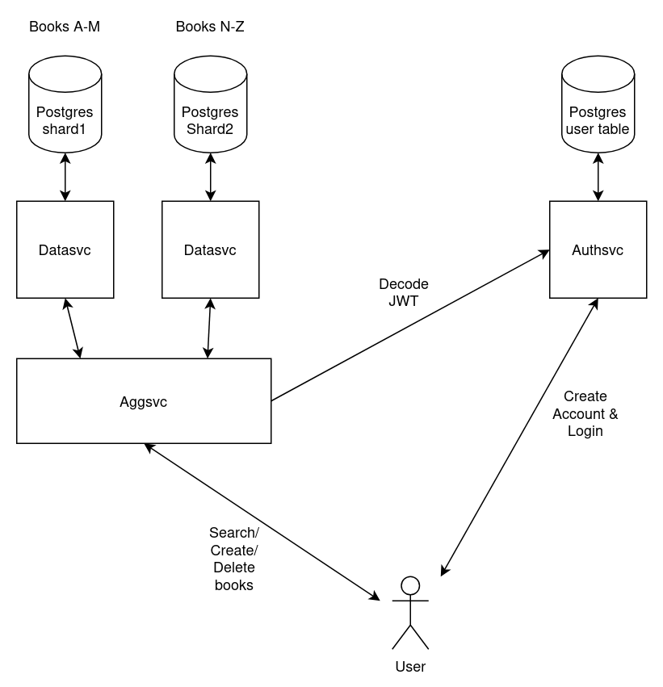

# Books management system

Currently the system has 4 microservices.
1. Authsvc for creating new accounts and logging in existing users.
2. Datashard svc. There are two instances of this service. One catters to books A-M and the other catters to books N-Z. When searching for books or removing books both the instances are targetted. 
3. Aggsvc aggregates results from both the instances of the datashard svc.

In this system all microservices run on the same host. 3 postgres DBs are needed for this. Each postgres DB lives in it's own instance. Scripts are provided for starting and stopping those instances and creating DBs, Users, tables etc.

Users should be able to search for books. Only admins can add or remove books from this collection.
